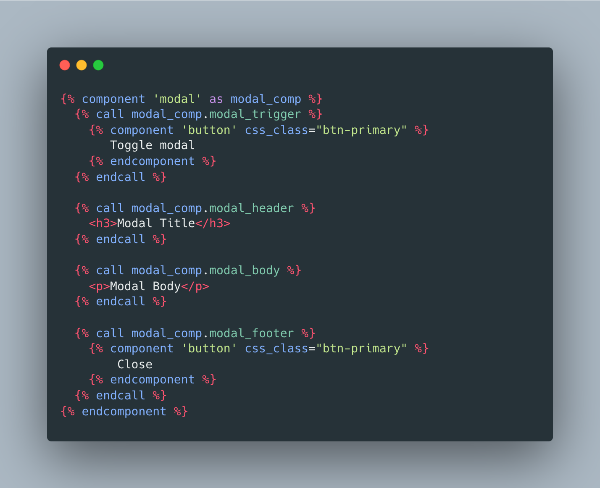
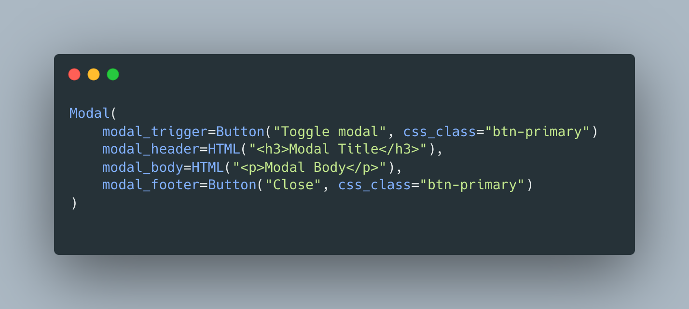

# README

django-viewcomponent is a Django library that provides a way to create reusable components for your Django project.

It is inspired by Rails [ViewComponent](https://viewcomponent.org/), which built by GitHub.com

For more insights into the problem it addresses and its design philosophy, check out [this video by GitHub Staff member Joel Hawksley](https://youtu.be/QoetqsBCsbE?si=28PCFCD4N4CyfKY7&t=624)

## Use Component in Django Template

You can create components and use them in Django templates.

## Use Component in Python

Or you can create components and use them in pure Python code.

## Why use django-viewcomponent

### Single responsibility

django-viewcomponent can help developers to build reusable components from the Django templates, and make the templates more readable and maintainable.

### Testing

django-viewcomponent components are Python objects, so they can be **easily tested** without touching Django view and Django urls.

## Documentation

[Documentation](https://django-viewcomponent.readthedocs.io/en/latest/)

## FAQ

### django-viewcomponent vs django-components

1. **django-viewcomponent** is inspired by Rails [ViewComponent](https://viewcomponent.org/), focusing solely on encapsulating Django templates without concerning itself with other elements such as frontend assets or generating Django responses.
2. The `slot` field in **django-viewcomponent** can be invoked multiple times to pass collections.
3. In **django-viewcomponent**, slot fields are declared in the Python component file rather than in the template file, making the slot field more flexible and easier to maintain.
4. **django-viewcomponent** includes a preview feature that allows developers to easily create component previews.
