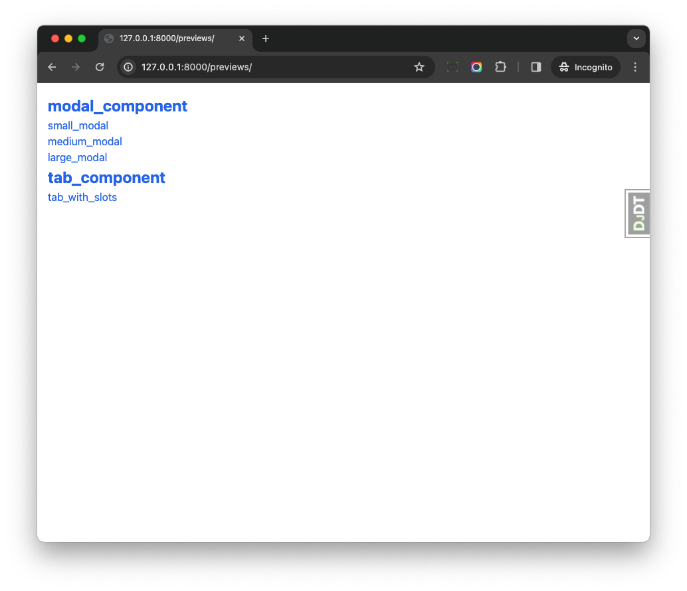
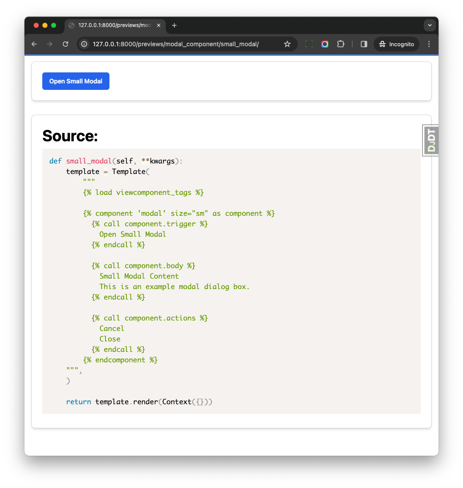

# Previews

We can create previews for our components, and check the result in the browser, just like Storybook.

## Config

Add below config to your Django settings

```python
VIEW_COMPONENTS = {
    "preview_base": ["django_app/tests/previews"],
}
```

`preview_base` is the base path for your previews. You can add multiple paths to it.

Add below url path to your Django urls

```python
path("previews/", include("django_viewcomponent.urls")),
```

So all the previews will work on the `/previews` path, I'd like to do that when `DEBUG` is `True`.

## Create a preview

```bash
django_app/tests/
├── previews
│   ├── modal_preview.py
│   └── tab_preview.py
```

Notes:

1. I'd like to put all previews under the `tests` directory, but you can put them anywhere you like.

```python
from django.template import Context, Template
from django_viewcomponent.preview import ViewComponentPreview


class ModalComponentPreview(ViewComponentPreview):
    def small_modal(self, **kwargs):
        template = Template(
            """
            

            
              
                <button class="btn btn-blue" data-action="click->modal#open:prevent">Open Small Modal</button>
              

              
                <h2 class="mb-4 text-xl">Small Modal Content</h2>
                <p class="mb-4">This is an example modal dialog box.</p>
              

              
                <button class="btn btn-white" data-action="click->modal#close:prevent">Cancel</button>
                <button class="btn btn-blue" data-action="click->modal#close:prevent">Close</button>
              
            
        """,
        )

        return template.render(Context({}))
```

Notes:

1. We create a `ModalComponentPreview`, which inherits from `ViewComponentPreview`.
2. We defined a public method `small_modal`, which will be used to render the preview, and `small_modal` is the name of the preview.
3. We can get `request.GET` from the `kwargs` parameter, and use it to render the preview.
4. In most cases, we can create one preview class for one component, and create multiple public method for one preview.

That is it!

## Check the preview

If we check [http://127.0.0.1:8000/previews/](http://127.0.0.1:8000/previews/), all previews will be listed there.



If we check the `small_modal` preview, we will see the result in the browser.



The great thing is, we can also see the source code of the preview, which helps us to understand how to use the component.

## Override Templates

You can also override the templates to fit your needs, please check the template files under `django_viewcomponent/templates/django_viewcomponent` to learn more.
