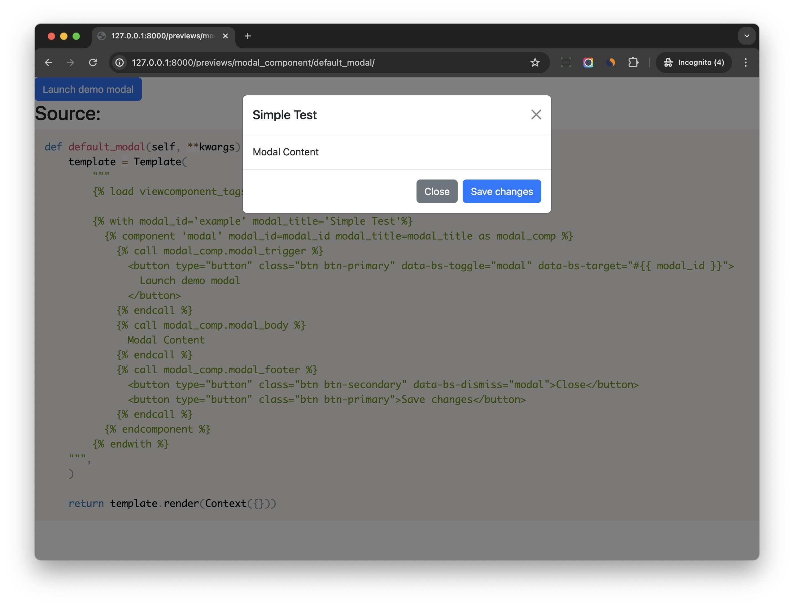
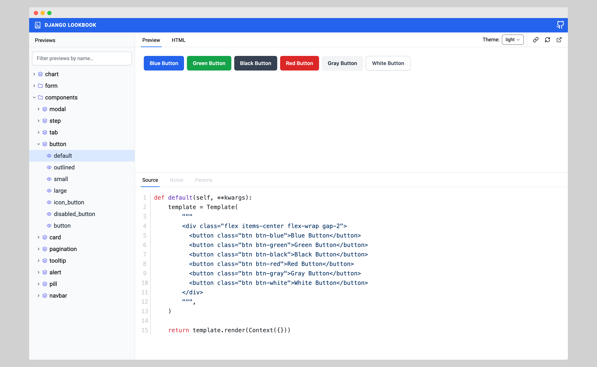

# Previews

We can create previews for our components, and check the result in the browser, just like Storybook.

## Config

Add below config to your Django settings

```python
VIEW_COMPONENTS = {
    "preview_base": ["previews"],
    "show_previews": DEBUG,
}
```

1. `preview_base` is the base path for your previews. You can add multiple paths to it.
2. `show_previews` is a boolean value, which is used to control whether to show the previews. It is `True` by default, here we set it with same value of `DEBUG`. So the previews will only be shown in the development environment.

Add below url path to your Django urls

```python
from django.contrib import admin
from django.urls import path, include

urlpatterns = [
    path('admin/', admin.site.urls),
    path("previews/", include("django_viewcomponent.urls")),      # new
]
```

## Create a preview

```bash
├── previews
│   ├── modal_preview.py
│   └── tab_preview.py
```

```python
from django.template import Context, Template
from django_viewcomponent.preview import ViewComponentPreview


class ModalComponentPreview(ViewComponentPreview):
    def default_modal(self, **kwargs):
        template = Template(
            """
            

            
              
                
                  <button type="button" class="btn btn-primary" data-bs-toggle="modal" data-bs-target="#{{ modal_id }}">
                    Launch demo modal
                  </button>
                
                
                  Modal Content
                
                
                  <button type="button" class="btn btn-secondary" data-bs-dismiss="modal">Close</button>
                  <button type="button" class="btn btn-primary">Save changes</button>
                
              
            
        """,
        )

        return template.render(Context({}))
```

Notes:

1. We create a `ModalComponentPreview`, which inherits from `ViewComponentPreview`.
2. We defined a public method `default_modal`, which will be used to render the preview, and `default_modal` is the name of the preview, the returned value is `preview_html` in the `django_viewcomponent/preview.html`
3. When Django server run, it will search files in the `preview_base` path, and render the preview by calling the methods, `default_modal` in this case.
4. In most cases, you can create multiple methods (multiple previews) for one component to demonstrate how to use the component.

## Override Template

Create *django_viewcomponent/preview.html* in the project `templates` directory

This template file will be used to render the `preview`.

And this is an example

```html
<!DOCTYPE html>
<html lang="en">
<head>
  <meta charset="UTF-8">
  <meta http-equiv="X-UA-Compatible" content="IE=edge">
  <meta name="viewport" content="width=device-width, initial-scale=1.0">
  <link rel="stylesheet" href="https://cdn.jsdelivr.net/npm/prismjs@1.28.0/themes/prism.min.css">
  <link href="https://cdn.jsdelivr.net/npm/bootstrap@5.2.3/dist/css/bootstrap.min.css" rel="stylesheet"
        integrity="sha384-rbsA2VBKQhggwzxH7pPCaAqO46MgnOM80zW1RWuH61DGLwZJEdK2Kadq2F9CUG65" crossorigin="anonymous">
</head>
<body>

<div>
  {{ preview_html }}
</div>

<div class="view-component-source-example">
  <h2>Source:</h2>
  <pre><code class="language-python">{{ preview_source }}</code></pre>
</div>

<script src="https://cdn.jsdelivr.net/npm/prismjs@1.28.0/prism.min.js"></script>
<script src="https://cdn.jsdelivr.net/npm/prismjs@1.28.0/components/prism-python.min.js"></script>
<script src="https://cdn.jsdelivr.net/npm/bootstrap@5.2.3/dist/js/bootstrap.bundle.min.js"
        integrity="sha384-kenU1KFdBIe4zVF0s0G1M5b4hcpxyD9F7jL+jjXkk+Q2h455rYXK/7HAuoJl+0I4"
        crossorigin="anonymous"></script>
</body>
</html>
```

1. We import Bootstrap CSS and JS to the page.
2. `preview_html` is the HTML generated by the preview method.

Now if we refresh the page and check again, the `preview` HTML should be rendered with Bootstrap CSS and JS.

```{note}
If you have other frontend assets such as Alpine.js, jQuery or CSS file, you should remember to include them in this template file `django_viewcomponent/preview.html`.
```

## Check the preview

If we restart app and check on [http://127.0.0.1:8000/previews](http://127.0.0.1:8000/previews), we should be able to see the all previews, if we click the `default_modal` link, we should be able to see the preview of the component and the code.



As you can see, the preview feature is very useful for us to develop and test the component in an isolated environment.

You can even build a simplified version of the component library with it.

## django-lookbook

If you're seeking a visually appealing dashboard to efficiently manage previews, consider exploring [django-lookbook](https://github.com/rails-inspire-django/django-lookbook) for an enhanced experience.


