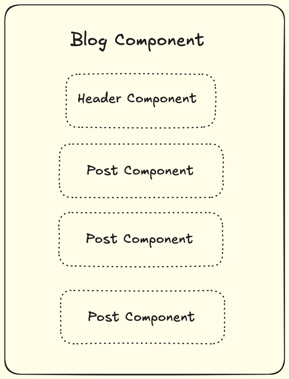

# Slots

If we want to pass more than one content block to the component, `self.content` is not enough, we can use `slots` to achieve this.

Unlike other packages which declare slot via ``, we define the slot in the component class, just like what we defined fields in the Django model

## Basic

Create *components/blog/blog.py*

```python
from django_viewcomponent import component
from django_viewcomponent.fields import RendersOneField


@component.register("blog")
class BlogComponent(component.Component):
    header = RendersOneField(required=True)

    template = """
        
        
        {{ self.header.value }}
    """
```

Notes:

1. `header` is a `RendersOneField` field, it means it can only render one content block, and it is `required`.
2. `self.header.value` means render the `header` slot field, please note `value` is needed here.

To use the component in Django templates:

```django

  
    <a href="/">My Site</a>
  

```

Notes:

1. `call blog_component.header` means we call the slot field `header` of the `blog_component`
2. The returning HTML would be:

```html
<a href="/">My Site</a>
```

## Check if the slot is filled

You can use `filled` attribute of the slot field to check if the slot is filled or not.

```django

    {{ self.header.value }}

    Default title

```

## Render multiple slots

Let's update `BlogComponent`

```python
from django_viewcomponent import component
from django_viewcomponent.fields import RendersOneField, RendersManyField


@component.register("blog")
class BlogComponent(component.Component):
    header = RendersOneField(required=True)
    posts = RendersManyField(required=True)        # new

    template = """
        
        
        {{ self.header.value }}
        
        
            {{ post }} 
        
    """
```

Notes:

1. `posts` is a `RendersManyField` field, it means it can render multiple content blocks, and it is `required`.
2. We use `` to iterate the `posts` slot field.

To use the component in Django templates:

```django

  
    <a href="/">My Site</a>
  

  
    <a href="/">Post 1</a>
  
  
    <a href="/">Post 2</a>
  


```

Notes:

1. We can call `blog_component.posts` multiple times to pass the block content to the slot field `posts`.

```html
<a href="/">My Site</a>
<a href="/">Post 1</a>
<a href="/">Post 2</a>
```

Or you can use django for loop do this:

```django

    
        <a href="/">My Site</a>
    
    
        
            <a href="/">{{ post.title }}</a>     
        
    

```

```{note}
Developer can use this approach to fill the slot field in a flexible way.
```

## Connect other component in the slot

This is the **killer feature** of this package, so please read it carefully.

### Component argument in RendersOneField

Let's update the `BlogComponent` again

```python
from django_viewcomponent import component
from django_viewcomponent.fields import RendersOneField, RendersManyField


@component.register("header")
class HeaderComponent(component.Component):
    def __init__(self, classes, **kwargs):
        self.classes = classes

    template = """
        <h1 class="{{ self.classes }}">
          {{ self.content }}
        </h1>
    """


@component.register("blog")
class BlogComponent(component.Component):
    header = RendersOneField(required=True, component='header')
    posts = RendersManyField(required=True)

    template = """
        
        
        {{ self.header.value }}
        
        
            {{ post }} 
        
    """
```

Notes:

1. We added a `HeaderComponent`, which accept a `classes` argument
2. `header = RendersOneField(required=True, component='header')` means when `{{ self.header.value }}` is rendered, it would use the `HeaderComponent` component to render the content.

```django


  
    <a href="/">My Site</a>
  

  
    <a href="/">Post 1</a>
  
  
    <a href="/">Post 2</a>
  


```

Notes:

1. When we call `blog_component.header`, the `classes` argument is passed to the `HeaderComponent` automatically.

The final HTML would be

```html
<h1 class="text-lg">
  <a href="/">My Site</a>
</h1>
<a href="/">Post 1</a>
<a href="/">Post 2</a>
```

Notes:

1. We do not need to store the `classes` to the `BlogComponent` and then pass it to the `HeaderComponent`, just set `component='header'` in the `RendersOneField` field, the `HeaderComponent` would receive the `classes` argument automatically
2. If you check the template code in the `BlogComponent`, `{{ self.header.value }}` ia very simple to help you understand what it is.

### Component argument in RendersManyField

If you have

```python
posts = RendersManyField(required=True, component="post")
```

In the view template

```django

    
        <a href="/">My Site</a>
    
    
        
    

```

Notes:

1. `qs` is a Django queryset, we iterate the queryset and fill the slot `posts` multiple times, `post` is also passed to the `PostComponent` automatically.

The `PostComponent` can be:

```python
class PostComponent(component.Component):
    def __init__(self, post, **kwargs):
        self.post = post

    template = """
    

    <h1>{{ self.post.title }}</h1>
    """
```

## Separation of concerns

The slot field and the `component` argument can help us build components with separation of concerns.

With `component` argument, we can **connect** components together, in clean way.



## Component argument in slot fields supports different variable types

### Component registered name

```python
@component.register("header")
class HeaderComponent(component.Component):
    def __init__(self, classes, **kwargs):
        self.classes = classes

    template = """
        <h1 class="{{ self.classes }}">
          {{ self.content }}
        </h1>
    """


@component.register("post")
class PostComponent(component.Component):
    def __init__(self, post, **kwargs):
        self.post = post

    template = """
        

        <h1>{{ self.post.title }}</h1>
        <div>{{ self.post.description }}</div>
        """


@component.register("blog")
class BlogComponent(component.Component):
    header = RendersOneField(required=True, component="header")
    posts = RendersManyField(required=True, component="post")

    template = """
        
        {{ self.header.value }}
        
          {{ post }}
        
        """
```

### Component class

```python
class BlogComponent(component.Component):
    class HeaderComponent(component.Component):
        def __init__(self, classes, **kwargs):
            self.classes = classes

        template = """
            <h1 class="{{ self.classes }}">
              {{ self.content }}
            </h1>
        """

    class PostComponent(component.Component):
        def __init__(self, post, **kwargs):
            self.post = post

        template = """
        

        <h1>{{ self.post.title }}</h1>
        <div>{{ self.post.description }}</div>
        """

    header = RendersOneField(required=True, component=HeaderComponent)
    posts = RendersManyField(required=True, component=PostComponent)

    template = """
    
    {{ self.header.value }}
    
      {{ post }}
    
    """
```

### Function which return string

If one component is very simple, we can use a function or lambda to return string.

```python
class BlogComponent(component.Component):
    header = RendersOneField(required=True, component="header")
    posts = RendersManyField(
        required=True,
        component=lambda self, post, **kwargs: mark_safe(
            f"""
            <h1>{post.title}</h1>
            <div>{post.description}</div>
        """,
        ),
    )

    template = """
    
    {{ self.header.value }}
    
      {{ post }}
    
    """
```

Notes:

1. Here we use lambda function to return string from the `post` variable, so we do not need to create a Component.
2. We can still use `self.xxx` to access value of the blog component.

### Function which return component instance

We can use function to return instance of a component, this is useful when we need to pass some special default values to the other component.

```python
class BlogComponent(component.Component):
    header = RendersOneField(required=True, component="header")
    posts = RendersManyField(
        required=True,
        component=lambda post, **kwargs: PostComponent(post=post),
    )

    template = """
        
        {{ self.header.value }}
        
          {{ post }}
        
        """
```

## Recursive Slot Field Call 

Combining render fields and `component` argument is very powerful, let's step further to see how to do recursive slot field call.

Let's assume you are building a generic table components:

```
Table
    Row
        Cell
```

Below is code example:

```python
class CellComponent(component.Component):

    template = """
    

    <td>{{ self.content }}</td>
    """


class RowComponent(component.Component):

    cells = RendersManyField(component=CellComponent)

    template = """
    

    <tr>
        
            {{ cell }}
        
    </tr>
    """


class TableComponent(component.Component):

    rows = RendersManyField(component=RowComponent)

    template = """
    

    <table>
       <tbody>
        
            {{ row }}
        
      </tbody>       
    </table>
    """
```

1. `TableComponent.rows -> RowComponent`
2. `RowComponent.cells -> CellComponent`

To render the table, we can do it like this:

```django



    
           -> Here we get the component of the slot field as `row_component`
                             -> We just fill the slot field by calling row_component.cells 
                <h1>{{ post.title }}</h1>
             
             
                <div>{{ post.description }}</div>
             
         
    

```

Notes:

1. To render `table cell`, we do not need to explicitly use ``, but using `` to do this in elegant way.

The final HTML would seem like:

```html
<table>
  <tbody>
  <tr>
    <td>
      <h1>post title</h1>
    </td>
    <td>
      <div>post desc</div>
    </td>
  </tr>
  </tbody>
</table>
```

## Polymorphic slots

Polymorphic slots can render one of several possible slots.

For example, consider this list item component that can be rendered with either an icon or an avatar. 

```python
class ListItemComponent(component.Component):
    item = RendersOneField(
        types={
            "avatar": AvatarComponent,
            "icon": lambda key, **kwargs: IconComponent(key=key),
        },
    )
```

The values in `types` can be the same as `component` argument in `RendersOneField`, it can be a string, a class, a function

Filling the slot is done calling `{field}_{type}`, please note the `type` key is set as `suffix` to the slot field.

```django



    



    

```
